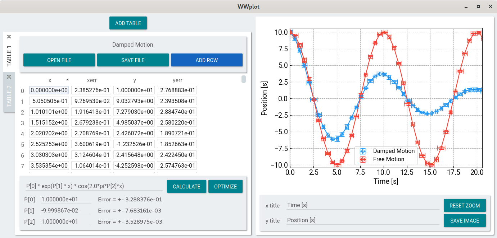

# WWplot

A simple plotting tool for experimental physics classes. It is being developed for the courses I give at
[Cefet-NI](http://www.cefet-rj.br/index.php/nova-iguacu).

Features:

- XY plot with error bars
- Linear and nonlinear fit
- Import and export table in TSV format (tab separated values)

Required libraries:

- Python 3 with Numpy, Scipy, PySide2, Matplotlib
- Qt 5 or above(on Arch Linux this means the packages qt5-base and qt5-declarative)

After installing the required libraries execute the main.py script in a
terminal:

    python main.py

I develop and test this software on Linux. It should be able to run on other operational systems but I did not test.
