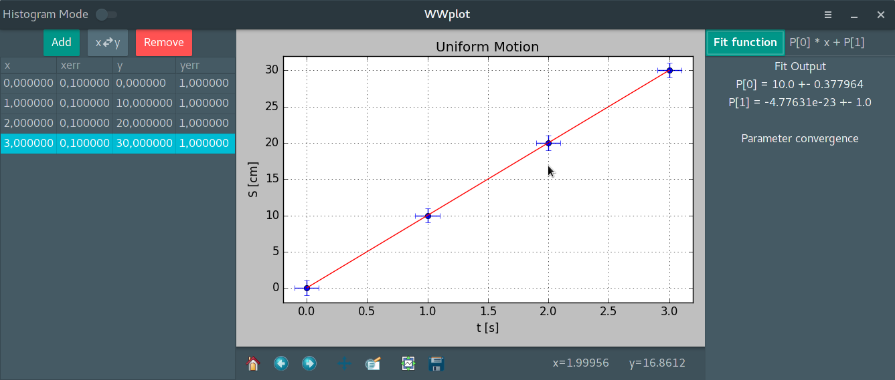

# WWplot

A simple plotting tool for experimental physics classes.

 

In order to run this program you will need:

- Python 3 with Numpy, Scipy, PyGobject 3, cairocffi, Matplotlib
- Gtk 3

After installing the required libraries execute the main.py script in a
terminal:

	python main.py

This program is developed and tested on Linux. I am not sure if it runs on Windows