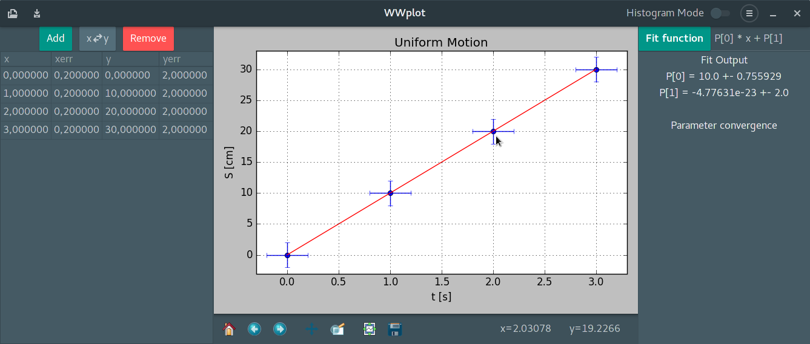
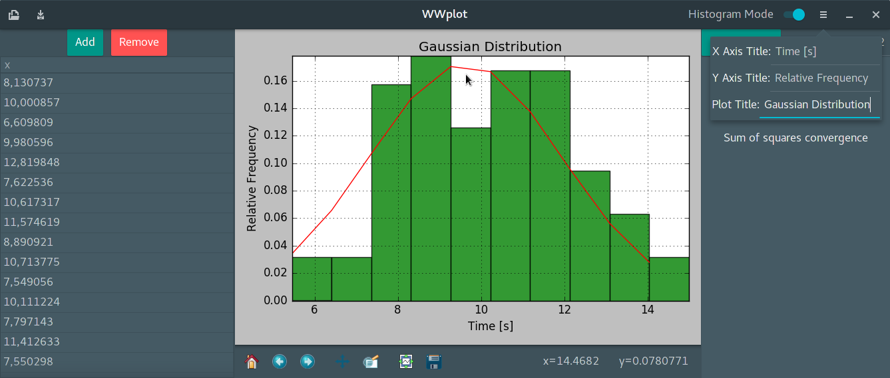
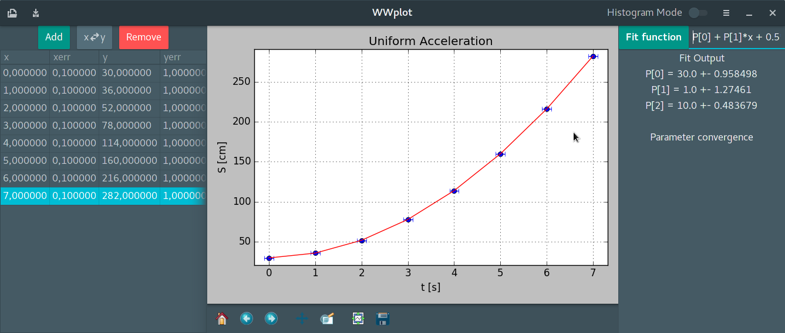

# WWplot

A simple plotting tool for experimental physics classes. It is being developed at [http://www.cefet-rj.br/index.php/nova-iguacu](http://www.cefet-rj.br/index.php/nova-iguacu).

 

Features:

- XY and histogram plot
- Linear and nonlinear fit
- Import and export table in TSV format (tab separated values) 

In order to run this program you will need:

- Python 3 with Numpy, Scipy, PyGobject 3, cairocffi, Matplotlib
- Gtk 3.18 or above

After installing the required libraries execute the main.py script in a
terminal:

	python main.py

This program is developed and tested on Linux. I am not sure if it runs on Windows. But it should be possible as only cross-platform libraries are being used.