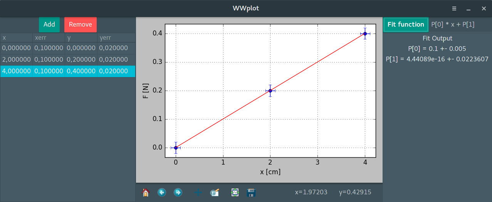

# WWplot

This program plots lab data. Its graphics interface was developed with
experimental physics classes in mind.

 

In order to run this program you will need:

- Python 3
- Numpy
- Scipy
- PyGobject
- cairocffi package for python
- Gtk 3
- Matplotlib

After installing the required libraries execute the main.py script in a
terminal:

python main.py
